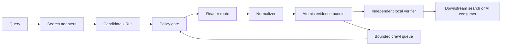

# Architecture

TraceFetch separates source discovery from evidence acquisition. A search hit is a candidate, a
successful HTTP response is an acquired artifact, and a verified bundle only proves internal
integrity. None of those states proves that a claim is true or that reuse is legally permitted.

## Data flow

The control plane is deliberately smaller than a browser automation framework or a distributed
crawler. It composes those systems through explicit adapters instead of reimplementing them.

## Stages and contracts

1. `search` asks one or more discovery providers for candidate URLs. It emits
   `tracefetch.search.v1`; it does not download or trust those candidates.
2. The policy gate canonicalizes URLs, checks domain rules, resolves DNS, rejects non-public
   targets by default, and evaluates robots rules.
3. A reader route records every attempted adapter. Remote and authenticated adapters are disabled
   by default and remain visible in the receipt even when an attempted remote call fails.
4. The normalizer derives Markdown and outgoing links. Exact bytes returned by the selected
   reader remain a separate raw artifact.
5. Bundle publication happens in a sibling staging directory. The final directory appears only
   after all files and the strict receipt validate.
6. `verify` recomputes artifact, source, anchor, link, quality, crawl-state, and path invariants.
7. A bounded crawl persists queue state in SQLite, retries only classified transient failures,
   remains same-origin, and resumes only when its reader and policy digest match.

## Trust layers

| Layer | What it establishes | What it does not establish |
|---|---|---|
| Search envelope | Which provider returned which candidate | Relevance, truth, permission |
| Raw artifact | Bytes returned by the recorded adapter | Origin-server identity when a remote reader was used |
| Derived artifacts | Deterministic local representation and addressable anchors | Semantic fidelity for every page format |
| Receipt | Self-reported route, policy, artifacts, and hashes | Trusted time, independent execution, third-party attestation |
| Verification | Bundle is internally consistent at verification time | Source truth, copyright status, terms compliance |

Receipts therefore carry `receipt_kind=unsigned-self-reported-diagnostic`, `attested=false`,
`trusted_clock=false`, and `independent_execution_proven=false`.

## Adapter topology

Built-in search providers are Exa through `mcporter` and GitHub through `gh`. Built-in readers are
direct HTTP, public Jina Reader, and authenticated Firecrawl. MarkItDown is an optional document
normalizer, not a network reader.

Python callers may inject a `ReaderAdapter` or `SearchProvider` under a new name. The CLI does not
dynamically load plugins or arbitrary commands in v0.1; exposing executable plugin discovery
would enlarge the trust boundary and needs a signed/allowlisted design first.

Browser, device, adaptive-extraction, and distributed-queue systems are extension targets. Their
output must still enter through the same `ReaderResult` and bundle verifier boundaries.

## Failure semantics

- Policy violations are non-retryable and use exit code 3.
- Missing adapters use exit code 4.
- Fetch failures use exit code 5 and carry a stable retryable flag.
- Verification failures use exit code 6.
- Auto routing may preserve direct raw bytes while selecting better normalized Markdown from a
  later remote reader. The complete route remains disclosed.
- A crawl that exhausts its page budget with pending URLs is `partial`, not `complete` or
  indefinitely `running`.

## Non-goals for v0.1

- Universal website coverage or CAPTCHA bypass.
- Login, form submission, purchasing, posting, or other state-changing browser actions.
- Distributed scheduling, proxy pools, or session farms.
- RAG indexing, embeddings, LLM generation, or truth scoring.
- Legal permission inference from robots rules or a successful response.
